## Lost Pet Finder

This is an android application for finding lost pets. The idea is to help people reunite lost pets with their owners.With smartphones being so ubiquitous now, we can use technologies like GPS, camera, and cellular data to solve the inefficacies of traditional posters

Each user can be signed in as a pet finder, or a pet owner who has lost their pet.

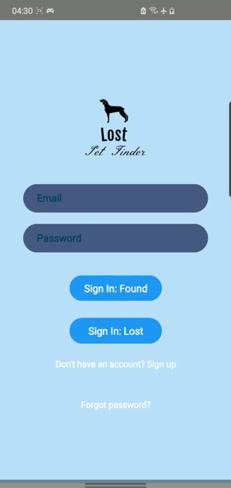

Upon login, the user has three possible actions: _Create A Report_, _Browse previous reports_, and _Contact Reporter_.

The effects of each action depend on what the type of the user is (finder or loser).

--------------------------------------------------------------------------------------------------------------------------------------------------------------------------------
*REPORT*
If a finder finds a lost pet, they can create a found pet report. If a pet owner has lost their pet, they can create a lost pet report.

The report must contain: where the pet was found/lost, when the pet was found/lost, and an image of the pet.

The location can be set by placing a marker on a map:

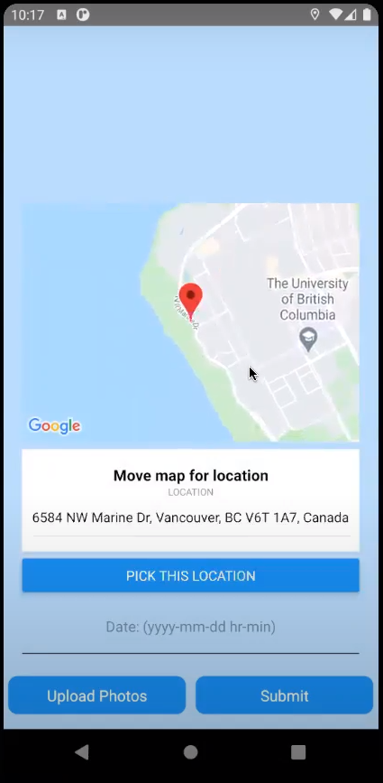

The date is manually entered in _yyyy/mm/dd hr_min_ format.

The user can upload a picture of the found/lost pet either by taking a picture inside the app, or from their camera roll.
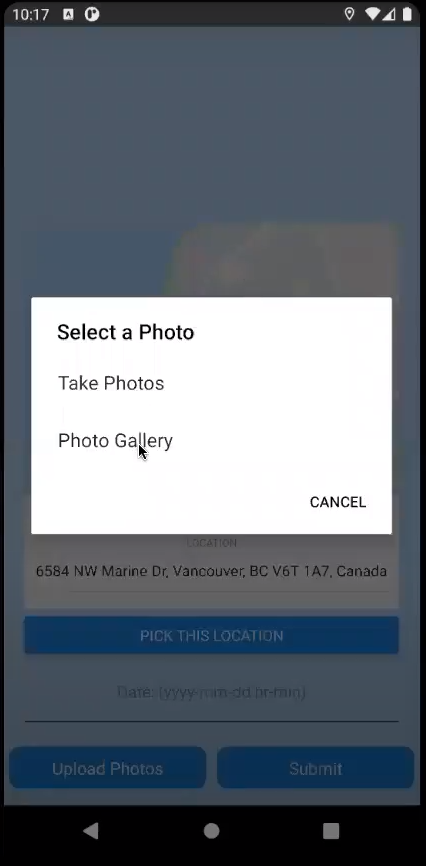

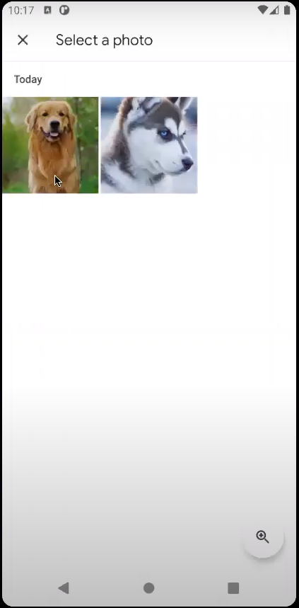

Completed report:

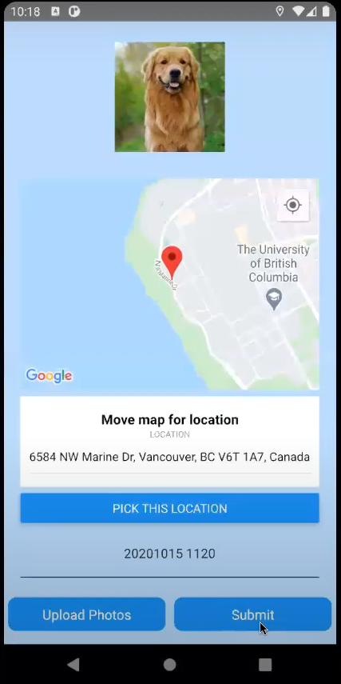

Once a report is completed, it can be used in the _other_ type of user's searches. That is, a found pet report will appear in a pet loser's searches, and a lost pet report will show up in a pet finder's searches.

--------------------------------------------------------------------------------------------------------------------------------------------------------------------------------
*SEARCH*
If a user has found a pet and has reported it, they may search previously reported _lost_ pets, to see if there is a potential match. Likewise, someone who has lost a pet and reported it may seacrh previously reported _found_ pets for a match.

The search results are ranked on similarity. 

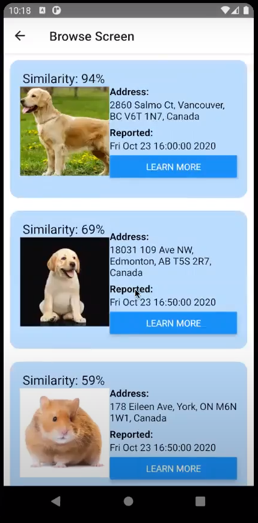

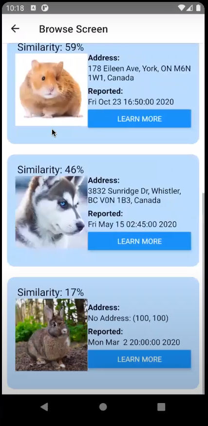

The above results' _similarity_ scores are compared to that of a light coloured dog.

A user may select _learn more_ to see the report information, the score breakdown of the similarity, and the contact button for the finder/loser.

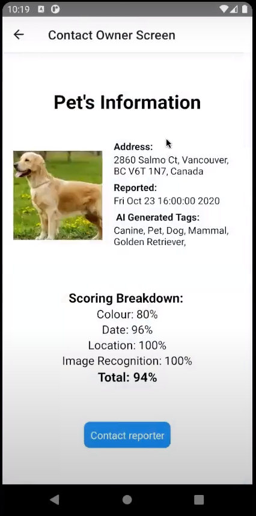

The score is based on four factors: colour, location, date, and Amazon Rekognition Generated species information. For the first three factors, for which a _difference_ may be calculated, the difference between the current user's report, and all the previous reports is calculated. The max difference then divides all other differences to normalize the scores. 

When a report is initially made, the image is analyzed to get the colour of the pet. Amazon Rekognition provides a box that tightly bounds the pet in the image. The colour of the background is then subtracted from the colour of the animal's box. 

Note the difference in colour scores for the following two reports, when compared to a light coloured pet:

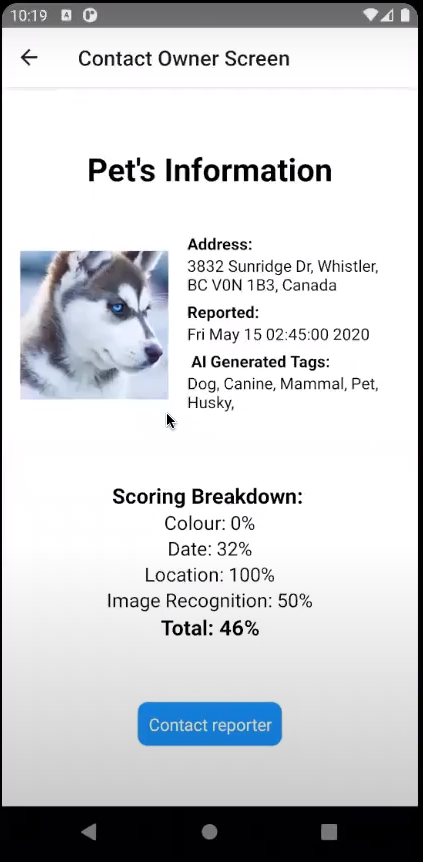

The location score is simply calculated by getting the dfference in the two physical locations.

The time score is calculated by getting the difference in dates, to the nearest hour.

The "image recognition score" is calculated by getting the number of _Amazon Rekognition_ species information tags that are shared by the two pets under comparison. 

Finally, if the user decides that there is a plausible match, they may attempt to contact the other reporter. 

--------------------------------------------------------------------------------------------------------------------------------------------------------------------------------
*CONTACT*
A user may view all their sent and received contact requests.

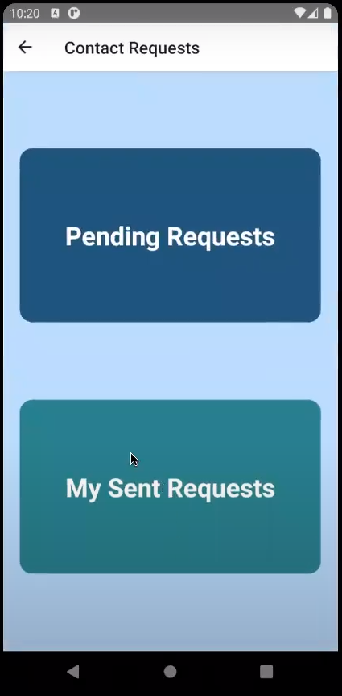

Received:

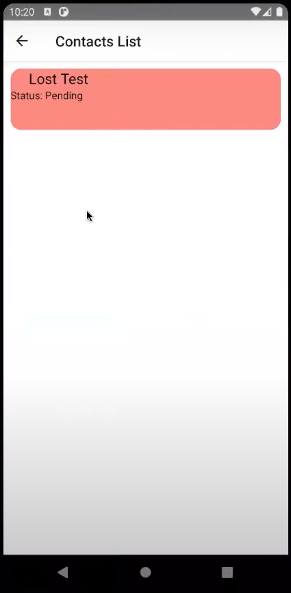

Sent:

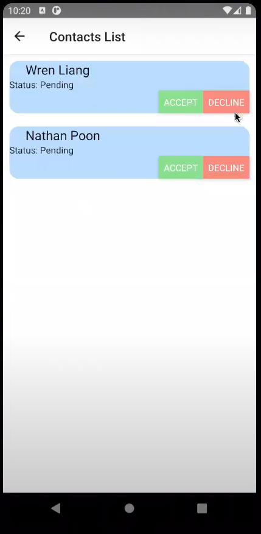

Once a request has been approved by both users, they can see each other's contact information:

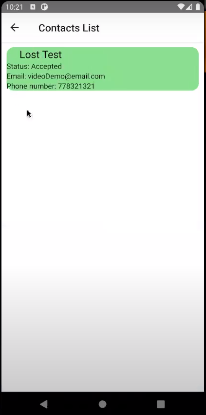

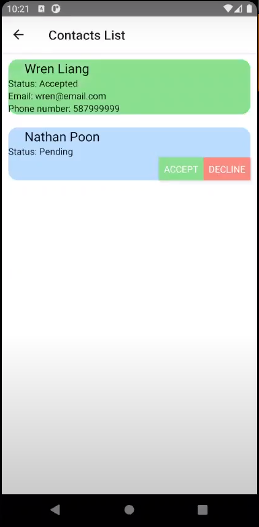
